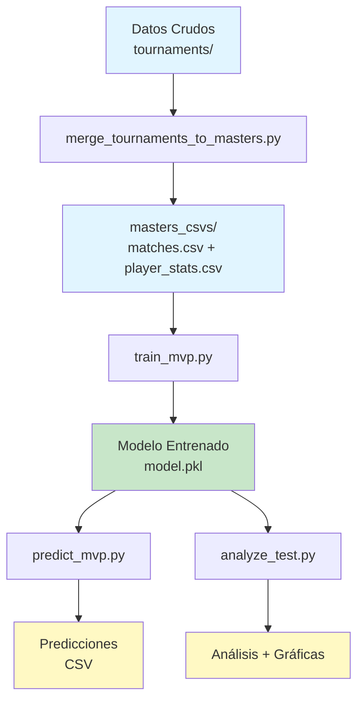

# 📚 Guía Completa del Modelo Valorant - Funcionamiento y Flujo

## 📁 Verificación de Estructura del Proyecto

### ✅ Estado Actual - Todo Correcto

#### Raíz del Proyecto
```
Valorant-Model/
├── .git/                    ✅ Control de versiones
├── .gitignore               ✅ Configuración git
├── .venv/                   ✅ Entorno virtual Python
├── README.md                ✅ Documentación principal
├── masters_csvs/            ✅ Datos consolidados (11 archivos)
├── mvp_model/               ✅ Código del modelo
├── scripts/                 ✅ Scripts de procesamiento
└── tournaments/             ✅ Datos por torneo (286 carpetas)
```

#### `mvp_model/` - Código del Modelo (6 archivos + 2 carpetas)

| Archivo | Tamaño | Propósito | Estado |
|---------|--------|-----------|--------|
| `__init__.py` | 23 bytes | Package marker | ✅ Necesario |
| `README.md` | 5.1 KB | Documentación del modelo | ✅ Necesario |
| `requirements.txt` | 141 bytes | Dependencias Python | ✅ Necesario |
| `train_mvp.py` | 5.8 KB | **Script de entrenamiento** | ✅ Necesario |
| `predict_mvp.py` | 2.8 KB | **Script de predicción** | ✅ Necesario |
| `analyze_test.py` | 8.5 KB | **Script de análisis** | ✅ Necesario |

**Carpetas**:
- `utils/` - 6 archivos de utilidades ✅
- `artifacts/` - 5 archivos + carpeta plots ✅
- `__pycache__/` - Cache de Python (auto-generado) ✅

#### `mvp_model/utils/` - Utilidades (6 archivos)

| Archivo | Tamaño | Propósito | Estado |
|---------|--------|-----------|--------|
| `__init__.py` | 1.2 KB | Exports del módulo | ✅ Necesario |
| `elo.py` | 1.8 KB | Sistema de rating Elo | ✅ Necesario |
| `features.py` | 3.6 KB | Construcción de features | ✅ Necesario |
| `data_loader.py` | 3.6 KB | Carga de datos | ✅ Necesario |
| `model_utils.py` | 3.4 KB | Utilidades de modelo | ✅ Necesario |
| `cli_args.py` | 2.3 KB | Argumentos CLI | ✅ Necesario |

#### `mvp_model/artifacts/` - Resultados (5 archivos + 1 carpeta)

| Archivo | Tamaño | Propósito | Estado |
|---------|--------|-----------|--------|
| `METRICAS_MODELO.md` | 15.8 KB | Documentación de métricas | ✅ Necesario |
| `model_test.pkl` | 2.1 KB | Modelo entrenado (test) | ✅ Generado |
| `metrics_test.json` | 122 bytes | Métricas del modelo | ✅ Generado |
| `train_info_test.json` | 433 bytes | Info de entrenamiento | ✅ Generado |
| `test_analysis.csv` | 351 bytes | Análisis de predicciones | ✅ Generado |
| `plots/` | - | Gráficas (3 archivos) | ✅ Generado |

**Archivos en `plots/`**:
- `test_calibration_curve.png` (47.6 KB) ✅
- `test_predictions_timeseries.png` (99.8 KB) ✅
- `test_metrics.json` (368 bytes) ✅

#### `scripts/` - Procesamiento de Datos (3 archivos + 1 carpeta)

| Archivo | Tamaño | Propósito | Estado |
|---------|--------|-----------|--------|
| `merge_tournaments_to_masters.py` | 5.6 KB | Consolida torneos | ✅ Necesario |
| `run_all.ps1` | 2.9 KB | Ejecución completa (Windows) | ✅ Necesario |
| `run_all.sh` | 2.4 KB | Ejecución completa (Linux) | ✅ Necesario |
| `utils/` | - | Utilidades de scripts | ✅ Necesario |

#### `scripts/utils/` - Utilidades de Scripts (2 archivos)

| Archivo | Tamaño | Propósito | Estado |
|---------|--------|-----------|--------|
| `__init__.py` | 46 bytes | Package marker | ✅ Necesario |
| `path_detection.py` | 2.2 KB | Detección de rutas | ✅ Necesario |

---

## 🔄 Flujo Completo del Modelo

### Diagrama de Flujo General



---

## 📊 Fase 1: Preparación de Datos

### 1.1 Consolidación de Torneos

**Script**: `scripts/merge_tournaments_to_masters.py`

**Entrada**:
- `tournaments/` - 286 carpetas, cada una con CSVs de un torneo

**Proceso**:
```python
# Para cada tipo de CSV (matches, player_stats, etc.)
for base_name in ["matches", "detailed_matches_player_stats", ...]:
    # Recorre todos los torneos
    for tournament in tournaments:
        # Lee el CSV del torneo
        data = read_csv(f"{tournament}/{base_name}.csv")
        # Agrega columna tournament_name
        data["tournament_name"] = tournament
        # Consolida todo en un solo archivo
```

**Salida**:
- `masters_csvs/matches.csv` - Todos los partidos consolidados
- `masters_csvs/detailed_matches_player_stats.csv` - Estadísticas de jugadores
- `masters_csvs/event_info.csv`, `maps_stats.csv`, etc.

**Comando**:
```bash
python scripts/merge_tournaments_to_masters.py
```

---

## 🧠 Fase 2: Entrenamiento del Modelo

### 2.1 Punto de Entrada

**Script**: `mvp_model/train_mvp.py`

**Función principal**: `main()` (línea 100)

```python
def main():
    # 1. Parsear argumentos
    args = parse_args()
    
    # 2. Cargar datos
    df = load_and_prepare_matches(args.csv_path)
    df_players = load_player_stats_csv(args.players_stats_path)
    
    # 3. Construir features
    X, y, meta = make_features(df, df_players, args.elo_k, args.elo_base)
    
    # 4. Split temporal
    X_train, X_test, y_train, y_test = time_train_test_split(X, y, 0.2)
    
    # 5. Entrenar modelo
    model = build_model(use_xgb=args.use_xgb)
    model.fit(X_train, y_train)
    
    # 6. Evaluar y guardar
    metrics = evaluate(model, X_test, y_test)
    joblib.dump(model, args.model_out)
```

### 2.2 Carga de Datos

**Módulo**: `mvp_model/utils/data_loader.py`

**Función**: `load_and_prepare_matches()`

```python
def load_and_prepare_matches(csv_path, filter_completed=True):
    # 1. Leer CSV
    df = pd.read_csv(csv_path)
    
    # 2. Filtrar solo partidos completados
    if filter_completed:
        df = df[df["status"] == "completed"]
    
    # 3. Parsear fechas
    df["parsed_date"] = pd.to_datetime(df["date"])
    
    # 4. Limpiar nombres de equipos
    df["team1"] = df["team1"].str.strip()
    df["team2"] = df["team2"].str.strip()
    df["winner"] = df["winner"].str.strip()
    
    # 5. Crear label binaria
    df["team1_win"] = (df["winner"] == df["team1"]).astype(int)
    
    # 6. Ordenar cronológicamente
    df = df.sort_values(["parsed_date", "match_id"])
    
    return df
```

### 2.3 Construcción de Features

**Módulo**: `mvp_model/utils/features.py`

**Función principal**: `build_full_features()`

#### Paso 1: Features de Elo

**Módulo**: `mvp_model/utils/elo.py`

```python
def build_elo_features(df, team1_col, team2_col, label_col, elo_k=32, elo_base=1500):
    ratings = {}  # Diccionario de ratings por equipo
    elo1_before = []
    elo2_before = []
    
    # Iterar cronológicamente
    for i, row in df.iterrows():
        t1, t2 = row[team1_col], row[team2_col]
        
        # Obtener ratings actuales (o base si es primera vez)
        r1 = ratings.get(t1, elo_base)  # Default: 1500
        r2 = ratings.get(t2, elo_base)
        
        # Guardar ratings ANTES del partido
        elo1_before.append(r1)
        elo2_before.append(r2)
        
        # Calcular probabilidad esperada
        e1 = 1 / (1 + 10**((r2 - r1) / 400))
        
        # Actualizar ratings DESPUÉS del partido
        y = row[label_col]  # 1 si gana team1, 0 si no
        r1_new = r1 + elo_k * (y - e1)
        r2_new = r2 + elo_k * ((1 - y) - (1 - e1))
        
        ratings[t1] = r1_new
        ratings[t2] = r2_new
    
    return pd.DataFrame({
        "elo1_before": elo1_before,
        "elo2_before": elo2_before,
        "elo_diff": elo1_before - elo2_before
    })
```

**Características clave del Elo**:
- ✅ **Temporal**: Se calcula en orden cronológico
- ✅ **Sin fuga**: Solo usa ratings ANTES del partido
- ✅ **Dinámico**: Se actualiza después de cada partido
- ✅ **K-factor**: 32 (velocidad de ajuste)
- ✅ **Base**: 1500 (rating inicial)

#### Paso 2: Features de Jugadores

```python
def build_team_aggregates(player_stats):
    # Agrupar por match_id y equipo
    agg = player_stats.groupby(["match_id", "player_team"]).agg({
        "acs": "mean",   # Average Combat Score promedio
        "kast": "mean"   # KAST promedio
    })
    
    return agg
```

**Métricas de jugadores**:
- **ACS (Average Combat Score)**: Impacto en combate (daño, kills, multi-kills)
- **KAST**: % de rounds con Kill/Assist/Survive/Trade

#### Paso 3: Unión de Features

```python
def build_full_features(matches_df, player_stats, elo_k, elo_base):
    # 1. Calcular Elo
    elo_feats = build_elo_features(matches_df, ...)
    
    # 2. Calcular agregados de jugadores
    team_agg = build_team_aggregates(player_stats)
    
    # 3. Unir todo
    df_all = matches_df.copy()
    df_all["elo1_before"] = elo_feats["elo1_before"]
    df_all["elo2_before"] = elo_feats["elo2_before"]
    df_all["elo_diff"] = elo_feats["elo_diff"]
    
    # 4. Agregar métricas de jugadores
    df_all = attach_team_features(df_all, team_agg)
    
    # 5. Calcular diferencias
    df_all["diff_acs_mean"] = df_all["team1_acs_mean"] - df_all["team2_acs_mean"]
    df_all["diff_kast_mean"] = df_all["team1_kast_mean"] - df_all["team2_kast_mean"]
    
    return df_all, features_df
```

### 2.4 Features Finales del Modelo

**Vector de features** (5 dimensiones):

| Feature | Descripción | Rango Típico |
|---------|-------------|--------------|
| `elo1_before` | Rating Elo del equipo 1 antes del partido | 1200-1800 |
| `elo2_before` | Rating Elo del equipo 2 antes del partido | 1200-1800 |
| `elo_diff` | Diferencia de Elo (team1 - team2) | -600 a +600 |
| `diff_acs_mean` | Diferencia de ACS promedio | -100 a +100 |
| `diff_kast_mean` | Diferencia de KAST promedio | -30 a +30 |

**Ejemplo de fila de features**:
```python
{
    "elo1_before": 1650.5,      # Team Liquid tiene buen rating
    "elo2_before": 1480.2,      # GIANTX tiene rating menor
    "elo_diff": 170.3,          # Liquid favorito por +170
    "diff_acs_mean": 15.3,      # Liquid mejor ACS
    "diff_kast_mean": 5.2       # Liquid mejor KAST
}
# Predicción esperada: ~75% probabilidad Team Liquid gana
```

### 2.5 Split Temporal

```python
def time_train_test_split(X, y, test_size=0.2):
    n = len(X)
    n_test = int(n * test_size)
    split = n - n_test
    
    # Los últimos 20% cronológicamente son test
    X_train = X[:split]
    X_test = X[split:]
    y_train = y[:split]
    y_test = y[split:]
    
    return X_train, X_test, y_train, y_test
```

**Importante**: Split temporal, NO aleatorio
- ✅ Entrena con partidos antiguos
- ✅ Evalúa con partidos recientes
- ✅ Simula predicción en tiempo real

### 2.6 Arquitectura del Modelo

**Pipeline de scikit-learn**:

```python
Pipeline([
    ("imputer", SimpleImputer(strategy="median")),  # Rellena NaNs
    ("scaler", StandardScaler()),                    # Normaliza features
    ("model", LogisticRegression(max_iter=200))     # Clasificador
])
```

**Modelo**: Regresión Logística
- **Tipo**: Clasificación binaria (team1 gana: 1, pierde: 0)
- **Salida**: Probabilidad entre 0 y 1
- **Interpretable**: Coeficientes muestran importancia de features

**Alternativa**: XGBoost (si se pasa `--use-xgb`)
- Más potente pero menos interpretable
- Mejores resultados en algunos casos

### 2.7 Evaluación

```python
def evaluate(model, X_test, y_test):
    proba = model.predict_proba(X_test)[:, 1]
    
    return {
        "log_loss": log_loss(y_test, proba),        # Menor es mejor
        "roc_auc": roc_auc_score(y_test, proba),    # Mayor es mejor (0.5-1.0)
        "brier": brier_score_loss(y_test, proba),   # Menor es mejor
        "n_test": len(y_test)
    }
```

### 2.8 Salidas del Entrenamiento

**Archivos generados**:

1. **`model.pkl`** (2.1 KB)
   - Modelo entrenado serializado
   - Incluye pipeline completo (imputer + scaler + modelo)

2. **`metrics.json`** (122 bytes)
   ```json
   {
     "log_loss": 0.2922,
     "roc_auc": 0.9453,
     "brier": 0.0935,
     "n_test": 188
   }
   ```

3. **`train_info.json`** (433 bytes)
   ```json
   {
     "timestamp": "2025-12-05T06:05:31Z",
     "n_total": 940,
     "n_train": 752,
     "n_test": 188,
     "elo_k": 32.0,
     "elo_base": 1500.0,
     "features": ["elo1_before", "elo2_before", "elo_diff", "diff_acs_mean", "diff_kast_mean"],
     "model_type": "LogisticRegression",
     "csv_path": "masters_csvs/matches.csv"
   }
   ```

**Comando de entrenamiento**:
```bash
python -m mvp_model.train_mvp \
  --csv-path masters_csvs/matches.csv \
  --players-stats-path masters_csvs/detailed_matches_player_stats.csv \
  --model-out mvp_model/artifacts/model.pkl \
  --metrics-out mvp_model/artifacts/metrics.json \
  --train-info-out mvp_model/artifacts/train_info.json
```

---

## 🔮 Fase 3: Predicción

### 3.1 Punto de Entrada

**Script**: `mvp_model/predict_mvp.py`

**Función principal**: `main()`

```python
def main():
    # 1. Cargar modelo entrenado
    model = joblib.load(args.model)
    
    # 2. Obtener nombres de features del entrenamiento
    feature_names = get_feature_names(args.train_info)
    
    # 3. Cargar y preparar datos nuevos
    df, X, match_ids = load_and_prepare(
        args.csv, args.players_stats_path, 
        args.elo_k, args.elo_base, feature_names
    )
    
    # 4. Predecir probabilidades
    proba = model.predict_proba(X)[:, 1]
    
    # 5. Generar CSV de salida
    out_df = pd.DataFrame({
        "match_id": match_ids,
        "team1": df["team1"],
        "team2": df["team2"],
        "p_team1_win": proba
    })
    
    out_df.to_csv(args.out, index=False)
```

### 3.2 Salida de Predicciones

**Formato del CSV**:
```csv
match_id,team1,team2,p_team1_win
530935,Team Liquid,GIANTX,0.971562
542279,FNATIC,DRX,0.975082
548123,Sentinels,NRG,0.623451
```

**Interpretación**:
- `p_team1_win = 0.97` → 97% probabilidad de que gane team1
- `p_team1_win = 0.50` → 50% probabilidad (partido parejo)
- `p_team1_win = 0.23` → 23% probabilidad (team2 favorito)

**Comando**:
```bash
python -m mvp_model.predict_mvp \
  --model mvp_model/artifacts/model.pkl \
  --csv masters_csvs/matches.csv \
  --out predictions.csv
```

---

## 📈 Fase 4: Análisis y Visualización

### 4.1 Script Unificado

**Script**: `mvp_model/analyze_test.py`

**Funcionalidades**:
1. ✅ Exportar predicciones a CSV
2. ✅ Imprimir resultados en consola
3. ✅ Generar gráficas
4. ✅ Calcular métricas completas

### 4.2 Métricas Calculadas

**Probabilísticas**:
- **Log Loss**: Penaliza predicciones incorrectas con alta confianza
- **ROC-AUC**: Capacidad de discriminar entre clases (0.9453 = excelente)
- **Brier Score**: Error cuadrático de probabilidades

**Discretas** (con threshold=0.5):
- **Accuracy**: 86.17% de predicciones correctas
- **Precision**: 87.10% de predicciones positivas correctas
- **Recall**: 87.63% de casos positivos detectados
- **F1 Score**: 87.32% (media armónica)

### 4.3 Gráficas Generadas

#### 1. Serie Temporal de Predicciones

**Archivo**: `artifacts/plots/test_predictions_timeseries.png`

```
Probabilidad
    1.0 ┤     ●              ●    ●        ●
        │  ●     ●        ●    ●     ●  ●
    0.5 ┤────────────────────────────────────
        │        ●    ●            ●
    0.0 ┤  ●              ●
        └────────────────────────────────────▶ Tiempo
        
Línea azul: Probabilidad predicha
Puntos rojos: Resultado real (0 o 1)
```

**Interpretación**:
- Línea cerca de 1 cuando resultado es 1 → Buena predicción
- Línea cerca de 0 cuando resultado es 0 → Buena predicción

#### 2. Curva de Calibración

**Archivo**: `artifacts/plots/test_calibration_curve.png`

```
Fracción
Positiva
    1.0 ┤                    ●
        │                 ●
        │              ●
    0.5 ┤           ●
        │        ●
        │     ●
    0.0 ┤  ●
        └────────────────────▶ Predicción Media
        0.0              1.0
        
Línea gris: Calibración perfecta (diagonal)
Puntos azules: Modelo actual
```

**Interpretación**:
- Cerca de la diagonal = Bien calibrado
- Cuando predice 70%, realmente gana ~70% de las veces

### 4.4 Comandos de Análisis

```bash
# Exportar todo el test con gráficas
python -m mvp_model.analyze_test --all-test --plot

# Últimos 10 partidos con impresión
python -m mvp_model.analyze_test --last-n 10 --print

# Todo junto
python -m mvp_model.analyze_test --all-test --print --plot --out results.csv
```

---

## 🚀 Ejecución Completa

### Script Automatizado

**Windows**: `scripts/run_all.ps1`
**Linux**: `scripts/run_all.sh`

**Flujo completo**:

```powershell
# 1. Consolidar torneos
python scripts/merge_tournaments_to_masters.py

# 2. Entrenar modelo
python -m mvp_model.train_mvp

# 3. Exportar predicciones del test
python -m mvp_model.analyze_test --all-test --out test_preds.csv

# 4. Generar gráficas
python -m mvp_model.analyze_test --all-test --plot
```

**Ejecución**:
```bash
# Windows
.\scripts\run_all.ps1

# Linux
bash scripts/run_all.sh
```

---

## 🎯 Resumen del Flujo

### Datos → Modelo → Predicciones

```
1. DATOS CRUDOS
   tournaments/ (286 torneos)
   ↓
   
2. CONSOLIDACIÓN
   merge_tournaments_to_masters.py
   ↓
   masters_csvs/matches.csv (940 partidos)
   masters_csvs/detailed_matches_player_stats.csv
   ↓
   
3. PREPARACIÓN
   load_and_prepare_matches()
   - Filtrar completados
   - Parsear fechas
   - Crear labels
   - Ordenar cronológicamente
   ↓
   
4. FEATURES
   build_full_features()
   - Elo: elo1_before, elo2_before, elo_diff
   - Jugadores: diff_acs_mean, diff_kast_mean
   ↓
   Vector de 5 features por partido
   ↓
   
5. SPLIT TEMPORAL
   80% train (752 partidos) | 20% test (188 partidos)
   ↓
   
6. ENTRENAMIENTO
   Pipeline: Imputer → Scaler → LogisticRegression
   ↓
   model.pkl (2.1 KB)
   ↓
   
7. EVALUACIÓN
   ROC-AUC: 0.9453 ✅
   Accuracy: 86.17% ✅
   ↓
   
8. PREDICCIÓN
   Nuevos partidos → Probabilidades
   ↓
   
9. ANÁLISIS
   CSV + Gráficas + Métricas
```

---

## 📊 Resultados Actuales

### Métricas del Modelo

| Métrica | Valor | Interpretación |
|---------|-------|----------------|
| **ROC-AUC** | 0.9453 | Excelente discriminación |
| **Log Loss** | 0.2922 | Excelente calibración |
| **Brier Score** | 0.0935 | Predicciones precisas |
| **Accuracy** | 86.17% | 86 de cada 100 correctas |
| **Precision** | 87.10% | Pocas falsas alarmas |
| **Recall** | 87.63% | Detecta la mayoría de victorias |
| **F1 Score** | 87.32% | Balance excelente |

### Ejemplo de Predicción

**Input**:
```
Team Liquid vs GIANTX
- Liquid: Elo 1650, ACS 245, KAST 75%
- GIANTX: Elo 1480, ACS 230, KAST 70%
```

**Features**:
```python
{
    "elo1_before": 1650,
    "elo2_before": 1480,
    "elo_diff": 170,
    "diff_acs_mean": 15,
    "diff_kast_mean": 5
}
```

**Output**:
```
p_team1_win = 0.97 (97% probabilidad Team Liquid gana)
```

**Resultado real**: Team Liquid ganó ✅

---

## 🎓 Conclusión

El modelo Valorant funciona en 4 fases principales:

1. **Consolidación**: Une datos de 286 torneos
2. **Entrenamiento**: Construye features (Elo + métricas de jugadores) y entrena Regresión Logística
3. **Predicción**: Genera probabilidades para nuevos partidos
4. **Análisis**: Evalúa rendimiento con métricas y gráficas

**Fortalezas**:
- ✅ Sistema Elo temporal (sin fuga de información)
- ✅ Features de jugadores agregadas por equipo
- ✅ Split temporal (simula predicción real)
- ✅ Alta precisión (86% accuracy, 0.945 ROC-AUC)
- ✅ Bien calibrado (predicciones confiables)

**Todos los archivos del proyecto son necesarios y están correctamente organizados.**
